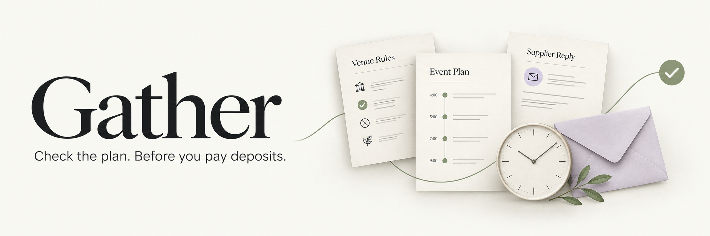
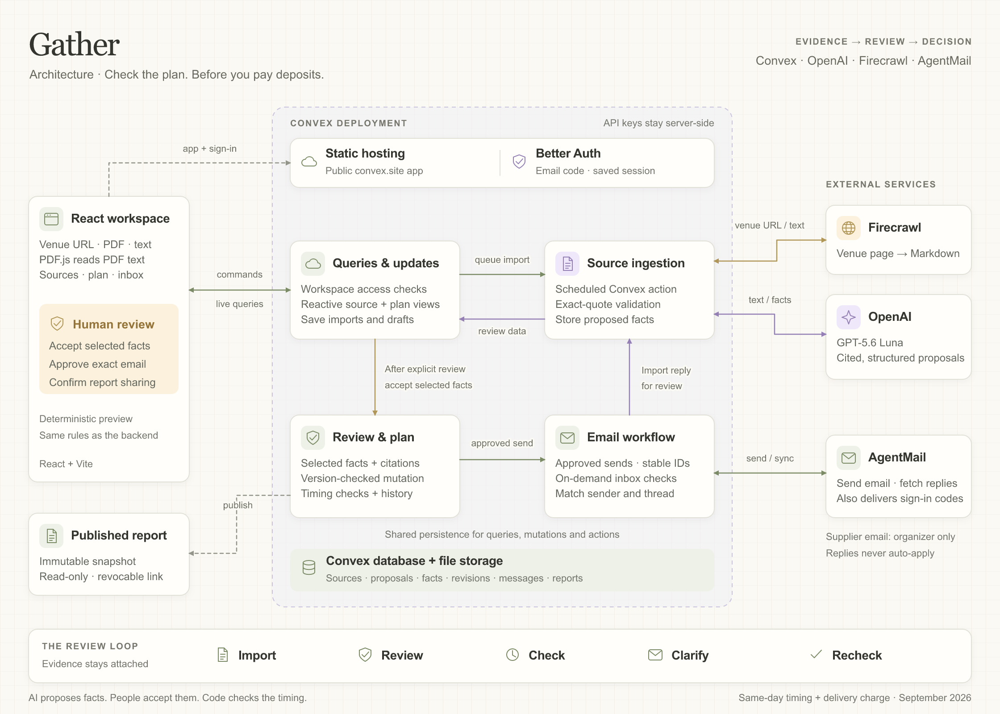

# Gather

**Check the plan. Before you pay deposits.**

**[Try Gather](https://clever-boar-260.convex.site/)** · **[Watch the demo · 2:44](https://x.com/olathepavilion/status/2102243994855997558)** · [Hackathon entry](https://vibeapps.dev/s/gather-1) · [Architecture](#architecture) · [Hackathon build log](hackathon.md)

## Table of contents

- [Project overview](#project-overview)
- [What Gather does](#what-gather-does)
- [A plan that actually fits](#a-plan-that-actually-fits)
- [Architecture](#architecture)
- [External apps and services](#external-apps-and-services)
- [How we used Convex](#how-we-used-convex)
- [How we used OpenAI](#how-we-used-openai)
- [How we used Firecrawl](#how-we-used-firecrawl)
- [How we used AgentMail](#how-we-used-agentmail)
- [Local setup](#local-setup)
- [Connect the integrations](#connect-the-integrations)
- [Reliability and evaluation](#reliability-and-evaluation)
- [Current limitations](#current-limitations)
- [Deployment](#deployment)
- [Demo video](#demo-video)
- [Repository contents](#repository-contents)
- [Development and creative tools](#development-and-creative-tools)

## Project overview

Gather helps event organizers **check whether venue rules, supplier proposals and their schedule work together before paying deposits**.

A rental delivery can sound reasonable in an email and still arrive too late for setup. A pickup can be agreed with a supplier and still run past the venue's closing time. The problem sits between documents, messages and the schedule.

Gather brings those details together, shows the clashes with their supporting evidence, and helps the organizer ask the supplier for a workable change. When a reply arrives, the organizer reviews what would change before accepting it. The plan recalculates, and the original evidence stays attached.

Built for the **[Convex All Gas Hackathon](https://www.convex.dev/hackathons/all-gas)** with Convex, OpenAI, Firecrawl and AgentMail. The workflow applies to dinners, launches, community events, weddings and other events with venue and supplier timing constraints. The current implementation checks one set of same-day event timings and the delivery charge.

The landing page and published example report are accessible without signing in. Anyone can create their own workspace using an emailed sign-in code. Supplier email in the hosted preview is connected to the organizer's workspace; visitors do not inherit access to that inbox.

## What Gather does

1. **Collect the evidence.** Import a public venue page, upload a text-based PDF/TXT/Markdown document, paste an event brief, or bring in a supplier reply.
2. **Review the details.** Open the original source and exact supporting quotation for each proposed fact. Accept selected facts or add a cited correction yourself.
3. **Check the timing.** Calculate when setup finishes and equipment is removed. See clashes and missing delivery charges separately.
4. **Ask a useful question.** Draft a clarification from the current plan. Review the recipient and exact message before sending.
5. **Review the reply.** Match the supplier's response to the event, extract proposed changes, and preview their impact. Receiving an email does not change the plan.
6. **Keep a clear record.** Compare plan versions and publish a revocable, read-only report containing selected evidence and calculations.

Accepting facts, sending an email and publishing a report are separate actions. Gather does not book a venue, approve a supplier contract or pay a deposit.

## A plan that actually fits

The demo follows **Founders' Dinner**, an illustrative event with real source imports and a real email exchange between two inboxes we control.

| Detail | Original plan | After reviewing the reply |
| --- | --- | --- |
| Guests arrive | 18:00 | 18:00 |
| Delivery complete | 17:15 | 16:30 |
| Setup duration | 75 minutes | 75 minutes |
| Ready for guests | **18:30 — 30 minutes late** | **17:45 — 15 minutes early** |
| Pickup starts | 21:40 | 21:10 |
| Loading duration | 35 minutes | 35 minutes |
| Equipment removed | **22:15 — 15 minutes over** | **21:45 — before the cutoff** |
| Delivery charge | Unknown | Explicitly free: USD 0 |

Only the new delivery time, pickup time and delivery charge are accepted. Existing durations and guest arrival stay unchanged. **Two timing clashes become zero**, with the reply and before/after calculations preserved.

The venue's public rules inform explicitly reviewed planning assumptions. They do not confirm a booking or a supplier appointment. The demo shows a working review loop, not a completed real-world event.

## Architecture

[](docs/architecture/gather-architecture.png)

**[View full-size PNG](docs/architecture/gather-architecture.png) · [Editable SVG](docs/architecture/gather-architecture.svg) · [Architecture walkthrough](docs/architecture/README.md)**

Convex connects the event workspace, source ingestion, review, supplier email and report history. Firecrawl reads venue pages; OpenAI proposes cited facts; the organizer accepts selected changes; deterministic code checks the timing. Approved messages go through AgentMail, and imported replies return through the same review process.

The diagram shows logical relationships. All Convex workflows share the database and file-storage layer; source progress and proposals reach the interface through reactive queries. Report sharing creates a separate, revocable snapshot after explicit confirmation.

## External apps and services

| Technology | Role in Gather |
| --- | --- |
| **Convex** | Persistent event workspaces, reactive queries, transactional review, scheduled actions, source storage, account membership and report snapshots. |
| **OpenAI** | GPT-5.6 Luna proposes structured timing and delivery-charge facts with exact source quotations. |
| **Firecrawl** | Reads public venue pages into source text the organizer can inspect. |
| **AgentMail** | Sends approved clarification emails, retrieves replies and delivers email sign-in codes. |
| **Better Auth's Convex component** | Email-code authentication and durable sessions. |
| **Convex static-hosting component** | Serves the application on its public `convex.site` URL. |
| **React, Vite and TypeScript** | Frontend, build tooling and typed backend functions. |
| **PDF.js** | Reads text from uploaded PDFs in the browser. |

Firecrawl and AgentMail use server-side API calls. The installed Convex components are Better Auth and static hosting.

## How we used Convex

Convex owns the application's state and review workflow:

- **Reactive queries** keep the plan, source progress and inbox views synchronized with saved data.
- **Mutations** accept selected facts, preserve earlier versions and reject stale reviews when the plan has changed.
- **Scheduled actions** run source ingestion and approved email sends after the relevant state is saved.
- **Database and file storage** retain events, original documents, source text, proposed facts, messages and activity history.
- **Workspace membership checks** protect private events and sources. Report publication creates a separate, immutable snapshot; revocation disables its public link.
- **Components** provide Better Auth persistence and static hosting on the same Convex deployment.

See [schema](convex/schema.ts), [source review](convex/sources.ts), [mail workflow](convex/mail.ts), [access checks](convex/access.ts), [public reports](convex/reports.ts) and [component registration](convex/convex.config.ts).

## How we used OpenAI

Gather calls the **OpenAI Responses API with GPT-5.6 Luna** to turn source text into structured proposals. The response schema distinguishes delivery completion, setup duration, guest arrival, venue access, pickup, loading and the USD delivery charge.

Each proposed value must carry an exact quotation. Application code checks quotations and supported clock values before a proposal can be accepted. Unknown or ambiguous information stays unknown; an unspecified charge never becomes zero. Older quoted email history must not silently replace the current sender's reply.

The model proposes facts. Deterministic code calculates timing clashes, and the organizer decides what enters the plan.

Extraction is restricted to Luna, with low reasoning, a 4,000-output-token cap and one model request per import attempt. There is no automatic model upgrade, fallback or retry. Hosted allowances limit import attempts; they are not an account-wide spending cap.

See [provider request](shared/providers.mjs), [schema and validation](shared/extraction.mjs) and [timing calculations](shared/plan.mjs). Codex also assisted with research, implementation, testing and release preparation.

## How we used Firecrawl

A venue URL becomes a saved source through **Firecrawl's scrape API**. Gather requests the page's main content as Markdown, preserves the returned source URL and text, and passes that evidence into the same review flow used for documents and emails.

This matters because a venue's rules often live on its website rather than in the organizer's brief. General opening hours or multiple hire packages must not be mistaken for confirmed access for this event. In the live checks, ambiguous public rules remained unknown until the organizer explicitly supplied cited planning assumptions.

A failed crawl leaves a visible error and an explicit retry option. Pasted text and document uploads remain alternatives.

See [venue-page retrieval](shared/providers.mjs) and [durable ingestion](convex/ingest.ts).

## How we used AgentMail

AgentMail closes the loop between finding a problem and getting an answer:

1. Gather drafts a clarification using the current plan's timing clashes and missing information.
2. The organizer checks the recipient, subject and exact body, then approves that revision for sending.
3. A Convex action sends the approved message through AgentMail with a stable idempotency key.
4. On-demand inbox checks retrieve replies. Sender and conversation matching associate a response with an event; unmatched mail stays unassigned.
5. The organizer imports the reply as evidence and reviews its proposed facts before changing the plan.

Approved messages are immutable. Duplicate incoming messages are detected, stale approvals are rejected, and an uncertain send can be explicitly retried with the same content and key within the supported window. AgentMail also delivers the app's sign-in codes.

See [mail state and approvals](convex/mail.ts), [provider actions](convex/mailActions.ts), [mail helpers](shared/mail.mjs) and [email-code authentication](convex/auth.ts).

## Local setup

Requires **Node.js 22.12 or later**; verification uses Node 22.23.1.

```sh
git clone https://github.com/Pavilion-devs/gather.git
cd gather
npm ci
CONVEX_AGENT_MODE=anonymous npm run backend
```

Keep that terminal running. In another terminal:

```sh
npx convex env set GATHER_LOCAL_WORKSPACES true
npm run dev
```

Open **http://127.0.0.1:5180/#plan**. The local backend uses ports 3216 and 3217. Convex creates the local deployment settings; ensure `.env.local` contains `VITE_CONVEX_URL=http://127.0.0.1:3216` and `VITE_CONVEX_SITE_URL=http://127.0.0.1:3217` before starting Vite.

The opt-in fictional sample and manual cited review work without provider keys. Local workspace mode is accepted only on a loopback backend; hosted accounts use verified identity and membership checks.

## Connect the integrations

Keep credentials in an ignored environment file and configure the selected **local** Convex deployment:

```sh
node scripts/configure-integrations.mjs /absolute/path/to/your/.env.local
node scripts/configure-mail.mjs /absolute/path/to/your/.env.local
```

| Backend setting | Purpose |
| --- | --- |
| `OPENAI_API_KEY` | Live source extraction. |
| `OPENAI_MODEL=gpt-5.6-luna` | Required extraction model; the setup helper fixes this value. |
| `FIRECRAWL_API_KEY` | Public venue-page imports. |
| `AGENTMAIL_API_KEY` | Outbound email, inbox checks and sign-in email. |

Use an AgentMail inbox you own. The current inbox identifier is configured in [shared/mail.mjs](shared/mail.mjs); change it for your own deployment. Hosted setup also requires the auth settings and verified mail-owner address described in [deployment notes](docs/deployment.md).

Keys stay on the backend. Do not put them in `VITE_` variables or commit environment files. Live extraction, crawling and email use the configured providers' allowances.

## Reliability and evaluation

```sh
npm test
npm run test:mail
npm run typecheck
npm run build
```

The local integration suite requires the local Convex backend:

```sh
npm run test:integration
```

On September 22, 2026, **21 domain/provider tests and 19 Convex tests passed**, along with TypeScript checking. Coverage includes timing calculations, source quotations, price-versus-clock confusion, unknown values, concurrent acceptance, stale replies, immutable email approval, account isolation and public report publication/revocation.

Twelve authored source cases were also exercised with live Luna. Their saved [evaluation report](docs/evaluations/2026-09-21T14-13-31-269Z.json) records the inputs, outputs and individual results. Those controlled cases are not a broad accuracy benchmark.

[Live verification notes](docs/live-verification.md) document actual venue crawling, source extraction, sign-in, the owned-inbox email round trip and accepted-plan persistence. Historical notes retain the scope and outcomes of those sessions.

## Current limitations

- One set of event timing facts per plan. Arbitrary multi-day schedules and full coordination across multiple suppliers are not implemented.
- Delivery-charge extraction is limited to USD or explicitly free delivery. Full supplier totals, payments and booking approvals are outside the current workflow.
- Text-based PDFs are supported; scanned PDFs need pasted text. Incoming email attachments require a separate upload.
- Inbox checking is on demand. The hosted supplier inbox is limited to the configured organizer; per-user inbox provisioning and team invitations are not implemented.
- The preview allows 10 import attempts per workspace and 50 across the deployment per UTC day. Failed attempts count toward the allowance.
- Public reports contain selected excerpts. The organizer must review the snapshot for private information before publishing.
- Passing timing checks does not confirm a booking or establish that every event constraint has been checked.

## Deployment

**Live app: [clever-boar-260.convex.site](https://clever-boar-260.convex.site/)**

The React build is served by Convex's static-hosting component. Auth routes and the backend run on the same production deployment.

For this project's configured deployment, `npm run deploy` builds the frontend, deploys the backend and uploads the static bundle. The deployment script deliberately checks Gather's destination; adapt its settings before deploying a fork. See [deployment notes](docs/deployment.md).

## Demo video

**[Watch the demo on X · 2:44](https://x.com/olathepavilion/status/2102243994855997558)**

[Architecture thread](https://x.com/olathepavilion/status/2102243998270202338)

The **2:44** video opens on the landing page, then follows the actual product: import evidence → review facts → find two timing clashes → send a clarification → receive a reply → accept selected changes → compare the updated plan and its evidence.

Waiting time is shortened for pacing. The event and supplier are illustrative; source imports, model calls, email delivery and plan updates are real. Narration is generated with ElevenLabs. The edit, captions and motion graphics were made with HyperFrames.

## Repository contents

- `src/`: event workspace, source review, inbox, account flow, landing page and public report UI.
- `convex/`: schema, queries, mutations, actions, authentication and hosting.
- `shared/`: timing rules, extraction validation and provider helpers.
- `tests/`: domain, provider, Convex and integration checks, plus authored source cases.
- `scripts/`: local integration configuration, evaluation and deployment tools.
- `public/`: application assets and the landing-page product clip.
- `docs/`: architecture artwork and walkthrough, deployment notes, verification evidence and the generated README banner.
- `hackathon.md`: build log, stack, live URL and submission links.

Local credentials, development databases, raw recordings and video-render caches are excluded from the source repository.

## Development and creative tools

Codex assisted with the build and verification. Google Stitch supported the initial screen design, with visual references from [Outcrowd's event dashboard](https://dribbble.com/shots/27123985-Event-Management-Dashboard-UI) and [Kredo's evidence-review workspace](https://dribbble.com/shots/27623706-Kredo-AI-Claims-Review-Workspace).

The README banner was generated with **ImageGen**. **ElevenLabs and HyperFrames** were used for the demo's narration and editing; they are production tools for the video, not runtime dependencies of Gather.
